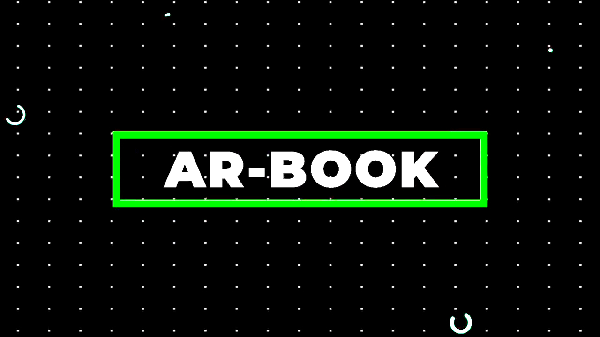
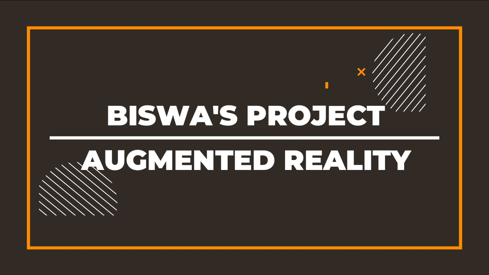
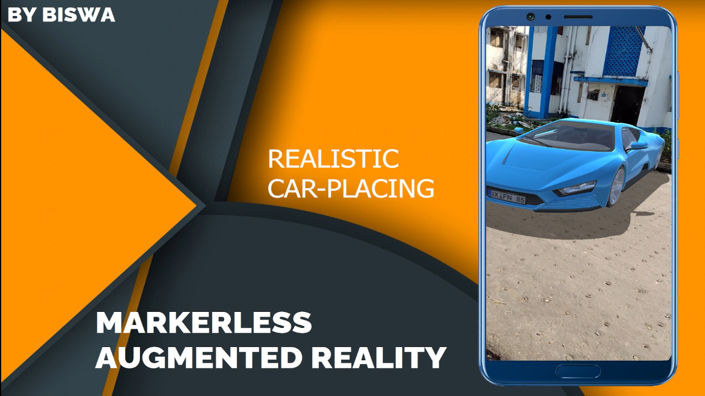
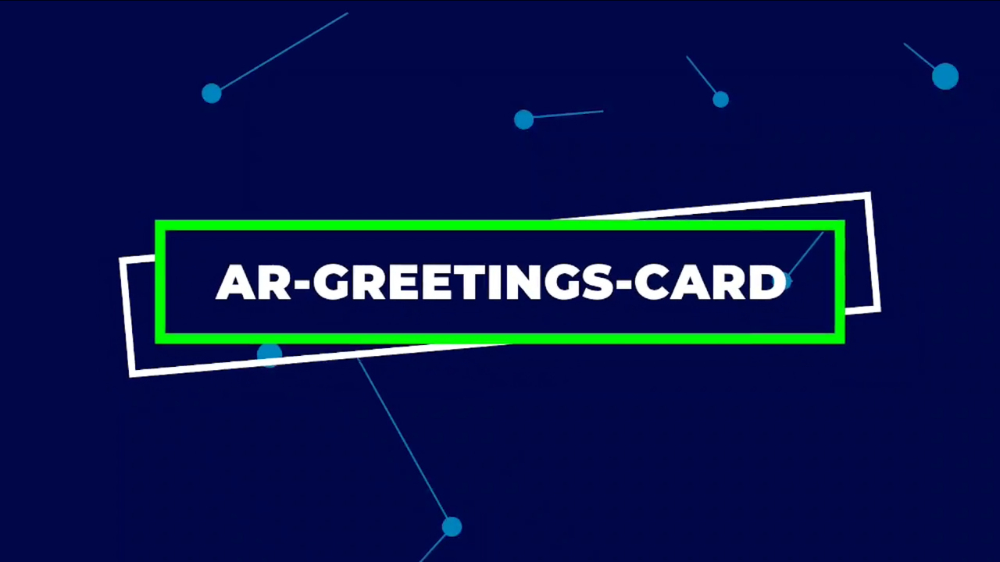
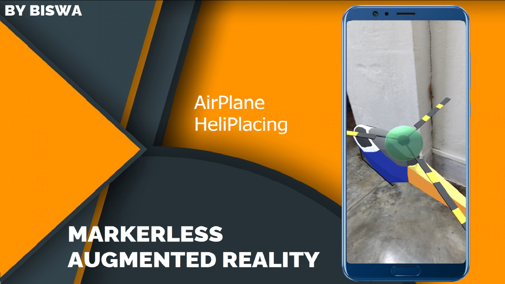
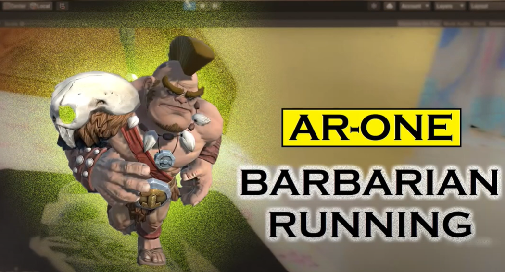
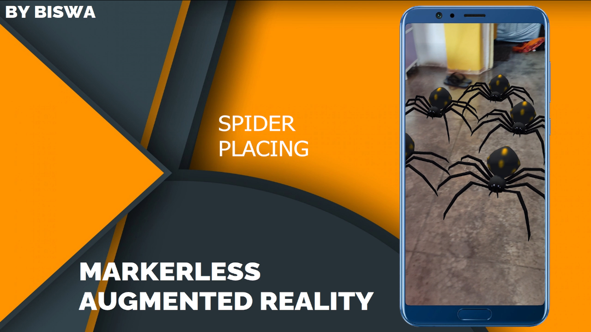

# Augmented-Reality-Projects :star_struck: :open_mouth: :running: :spider: :car: :helicopter: 

  
 

***These Augmented Reality Projects are created by Biswarup Bhattacharjee, student of BTECH, in University of Engineering and Management, Kolkata.***

**Email Id: bbiswa471@gmail.com.** 

**Contact No: 916290272740.** 

## About :point_down: 

    
Augmented reality is an interactive experience of a real-world environment where the objects that reside in the real world are enhanced by computer-generated perceptual information, sometimes across multiple sensory modalities, including visual, auditory, haptic, somatosensory and olfactory. I have created 10 augmented reality projects. 4 of them are mobile apps. These apps are used to place box, spiders, car, helicopters on a plane. When we tap on phone this works. First ball dropping and barberian king are my first projects in augmented reality. The barberian king runs on a marked plane like a mouse pad or table etc. For AR book I had drawn some pictures in dotted lines like sun, home, car, airoplane, clouds etc. When we place the camera before the drawing we can see the things. I had made a greeting card for my friend's bday. When we place the camera before the greeting card a birthday music starts and my friend's pictures are visible. As soon as we close the greeting card the music and pictures stops. My fav list card is a collection of my favourite music, movie, web series etc. Here the music is played and the movie, web series scenes are played. For more details checkout my yu tube playlist on Augmented Reality Projects.

### :point_right: <a href="">Click here to go to my Augmented Reality Playlist</a>

## 1. Unity First ball Dropping
### :point_right: <a href="https://drive.google.com/file/d/1jW0mBl5U3HxKHYOk21np8VTleaVthiqK/view">Click here to get project</a>
### :point_right: <a href="">Click here to watch demo video</a>
### :point_right: Description--> It is a unity project. Here I have created a ball dropping in augmented reality.

## 2. Barberian King (Marker-based)
### :point_right: <a href="">Click here to get project</a>
### :point_right: <a href="https://www.youtube.com/watch?v=bmEUttjNySc&list=PL0lbDlMJ1h4hOjuRuo6K1uMTwxRTrwBZ9&index=2">Click here to watch demo video</a>
### :point_right: Description--> Here I have created a barberian king using augmented reality in Unity. It moves on a marked plane.

## 3. AR-Book (Marker Based AR) 
### :point_right: <a href="">Click here to get project</a>
### :point_right: <a href="https://www.youtube.com/watch?v=3qP42WlmMzQ&list=PL0lbDlMJ1h4hOjuRuo6K1uMTwxRTrwBZ9&index=2">Click here to watch demo video</a>
### :point_right: Description--> Here I have created a book using augmented reality. It moves on a marked plane according to the drawing. We can see sun, car etc.

## 4. Romi’s HBD Greeting Card (Marker Based AR)
### :point_right: <a href="https://drive.google.com/file/d/1n44HmGa0aR5J5vJmeHFyjsHH9Xm1lN_5/view">Click here to get project</a>
### :point_right: <a href="https://www.youtube.com/watch?v=OkjPuTc7F28&list=PL0lbDlMJ1h4hOjuRuo6K1uMTwxRTrwBZ9&index=3">Click here to watch demo video</a>
### :point_right: Description--> Here I have created a greeting card for my friend for birthday in augmented reality. When the card is opened the music and the photos of my friends can be seen.

## 5. My Fav List Card (Marker Based AR) 
### :point_right: <a href="https://drive.google.com/file/d/1MweqA8uXZPU_JIaGCtudFALyEenDXLIB/view">Click here to get project</a>
### :point_right: <a href="https://www.youtube.com/watch?v=wpvzp7GqWB4&list=PL0lbDlMJ1h4hOjuRuo6K1uMTwxRTrwBZ9&index=5">Click here to watch demo video</a>
### :point_right: Description--> Here I have created a fav list card in augmented reality. Here my fav web series movie etc are shown with playing music.

## 6. AR Virtual Buttons (Marker Based AR) 
### :point_right: <a href="">Click here to get project</a>
### :point_right: <a href="https://www.youtube.com/watch?v=Rt7nltykzWA&list=PL0lbDlMJ1h4hOjuRuo6K1uMTwxRTrwBZ9&index=5">Click here to watch demo video</a>
### :point_right: Description--> Here I have created virtual buttons in augmented reality. It moves on a marked plane.

## 7. Box Placing (MarkerLess AR) 
### :point_right: <a href="">Click here to get project</a>
### :point_right: <a href="https://www.youtube.com/watch?v=fqHgjUFmVtQ&list=PL0lbDlMJ1h4hOjuRuo6K1uMTwxRTrwBZ9&index=8">Click here to watch demo video</a>
### :point_right: <a href="https://drive.google.com/file/d/1nrZx_5iniHcp36JI8pM0tUj77-1psG1t/view">Click here to download app</a>
### :point_right: Description--> This is an augmented reality app which uses the technology of marker less augmented reality. In this app we can place box on a clear floor by touching on phone.

## 8. Multiple Spider Placing (MarkerLess AR) 
### :point_right: <a href="">Click here to get project</a>
### :point_right: <a href="https://www.youtube.com/watch?v=NZ9W4qDoX2Q&list=PL0lbDlMJ1h4hOjuRuo6K1uMTwxRTrwBZ9&index=6">Click here to watch demo video</a>
### :point_right: <a href="https://drive.google.com/file/d/1PtLedYmRLfPiMiISlcwVLE6YtaJ1UJgA/view">Click here to download app</a>
### :point_right: Description--> This is an augmented reality app which uses the technology of marker less augmented reality. In this app we can place multiple spiders on clear floor by touching on phone.

## 9. Car Placing (MarkerLess AR) 
### :point_right: <a href="">Click here to get project</a>
### :point_right: <a href="https://www.youtube.com/watch?v=j_5T-xIePNE&list=PL0lbDlMJ1h4hOjuRuo6K1uMTwxRTrwBZ9&index=7">Click here to watch demo video</a>
### :point_right: <a href="https://drive.google.com/file/d/17kRVrMaBs_ckFjiwxgoF-KCn3ll44xGk/view">Click here to download app</a>
### :point_right: Description-->This is an augmented reality app which uses the technology of marker less augmented reality. In this app we can place a car on a clear floor by touching on phone. 

## 10.	Multiple Airplane Heli Placing (MarkerLess AR)  
### :point_right: <a href="">Click here to get project</a>
### :point_right: <a href="https://www.youtube.com/watch?v=9iHeGCS5efI&list=PL0lbDlMJ1h4hOjuRuo6K1uMTwxRTrwBZ9&index=9">Click here to watch demo video</a>
### :point_right: <a href="https://drive.google.com/file/d/1yPotNeVPq3bQ_1aL4HeatAFEVBPOvKf_/view">Click here to download app</a>
### :point_right: Description-->This is an augmented reality app which uses the technology of marker less augmented reality. In this app we can place multiple helicopters on clear floor by touching on phone. 

### Here are tow types of augmented reality :point_down:

- [x] Marker-based.
- [x] Markerless.

## Purpose :point_down:

I have created these projects to practice augmented reality concepts and to know more about the subject. 

## Screenshots :point_down: 

    
 

 

 

 

